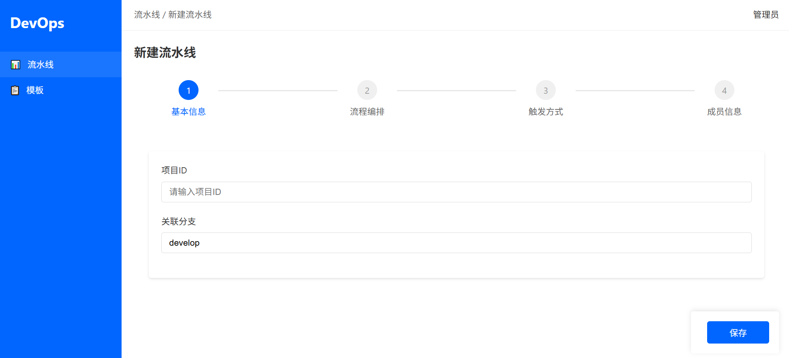
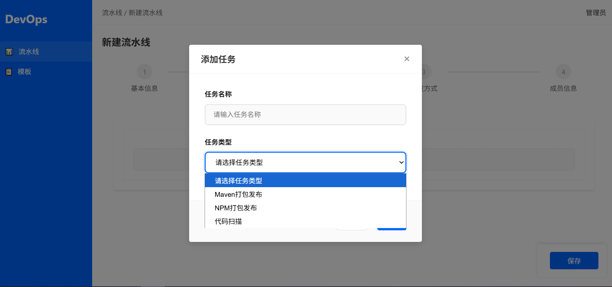
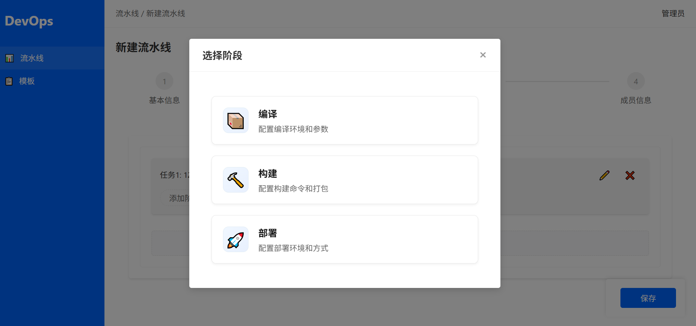
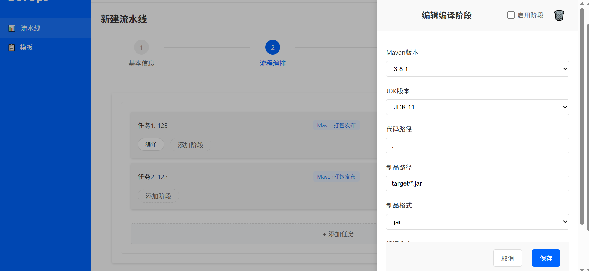
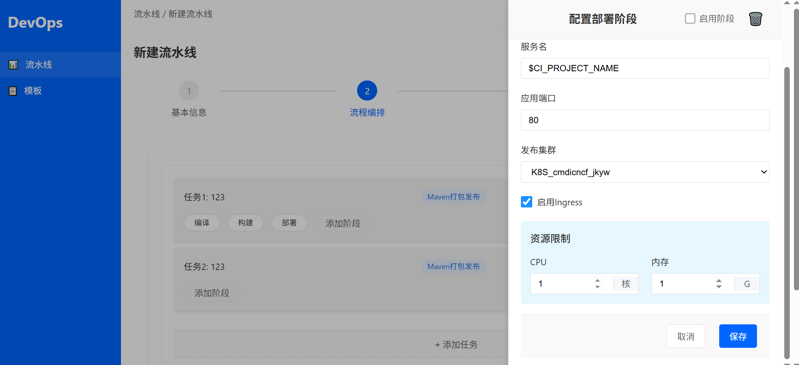

# devops
一款基于gitlab开源的CICD可视化编辑器，本项目使用cursor编写
## 页面概览

## 用法
修改backend\config\settings文件，更新数据库和gitlab实例地址为你本地的配置。
### 数据库连接配置
DB_CONFIG = {
    'dbname': '',
    'user': '',
    'password': '',
    'host': '',
    'port': ''
}

### GitLab API配置
GITLAB_API_URL = ''
GITLAB_NAMESPACE = 'cicd'  # GitLab命名空间/组
GITLAB_TOKEN = ''  # 替换为你的GitLab访问令牌